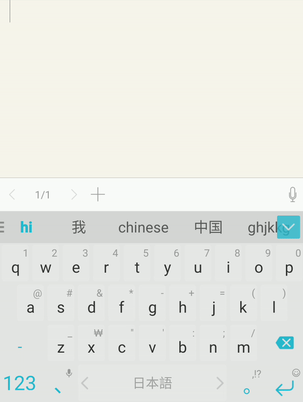
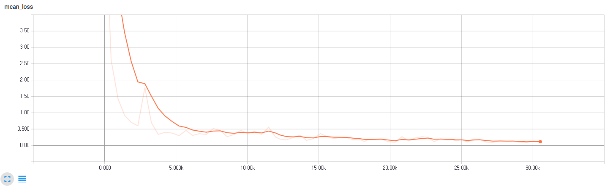

# Neural Japanese Transliteration—can you do better than SwiftKey™ Keyboard?

## Abstract
In this project, I examine how well neural networks can convert Roman letters into the Japanese script, i.e., Hiragana, Katakana, or Kanji. The accuracy evaluation results for 896 Japanese test sentences outperform the SwiftKey™ keyboard, a well-known smartphone multilingual keyboard, by a small margin. It seems that neural networks can learn this task easily and quickly.

## Requirements
  * NumPy >= 1.11.1
  * TensorFlow == 1.2
  * regex (Enables us to use convenient regular expression posix)
  * janome (for morph analysis)
  * romkan (for converting kana to romaji)

## Background

 
* The modern Japanese writing system employs three scripts: Hiragana, Katakana, and Chinese characters (kanji in Japanese).
* Hiragana and Katakana are phonetic, while Chinese characters are not.
* In the digital environment, people mostly type Roman alphabet (a.k.a. Romaji) to write Japanese. Basically, they rely on the suggestion the transliteration engine returns. Therefore, how accurately an engine can predict the word(s) the user has in mind is crucial with respect to a Japanese keyboard. 
* Look at the animation on the right. You are to type "nihongo", then the machine shows 日本語 on the suggestion bar.

## Problem Formulation
I frame the problem as a seq2seq task.

Inputs: nihongo。 
Outputs: 日本語。
 
## Data
* For training, we used [Leipzig Japanese Corpus](http://corpora2.informatik.uni-leipzig.de/download.html). 
* For evaluation, 896 Japanese sentences were collected separately. See `data/test.csv`.

## Model Architecture

I adopted the encoder and the first decoder architecture of [Tacotron](https://arxiv.org/abs/1703.10135), a speech synthesis model. 

## Contents
* `hyperparams.py` contains hyperparameters. You can change the value if necessary.
* `annotate.py` makes Romaji-Japanese parallel sentences.
* `prepro.py` defines and makes vocabulary and training data.
* `modules.py` has building blocks for networks.
* `networks.py` has encoding and decoding networks.
* `data_load.py` covers some functions regarding data loading.
* `utils.py` has utility functions.
* `train.py` is about training. 
* `eval.py` is about evaluation.

## Training

* STEP 1. Download [Leipzig Japanese Corpus](http://corpora2.informatik.uni-leipzig.de/downloads/jpn_news_2005-2008_1M-text.tar.gz) and extract `jpn_news_2005-2008_1M-sentences.txt` to `data/` folder.
* STEP 2. Adjust hyperparameters in `hyperparams.py` if necessary.
* STEP 3. Run `python annotate.py`.
* STEP 4. Run `python prepro.py`. Or download the [preprocessed files](https://www.dropbox.com/s/tv81rxcjr3x9eh1/preprocessed.zip?dl=0).
* STEP 5. Run `train.py`. Or download the [pretrained files](https://www.dropbox.com/s/wrbr7tnf4zva4bj/logdir.zip?dl=0).

## Testing
* STEP 1. Run `eval.py`.
* STEP 2. Install the latest SwiftKey keyboard app and manually test it for the same sentences. (Don't worry. You don't have to because I've done it:))

## Results

The training curve looks like this.

The evaluation metric is CER (Character Error Rate). Its formula is 

* edit distance / # characters = CER.

The following is the results after 13 epochs, or 79,898 global steps. Details are available in `results/*.csv`.

| Proposed (Greedy decoding) | Proposed (Beam decoding) | SwiftKey 6.4.8.57 |
|--- |--- |--- | 
|1595/12057=0.132 | 1517/12057=0.125 | 1640/12057=0.136|

